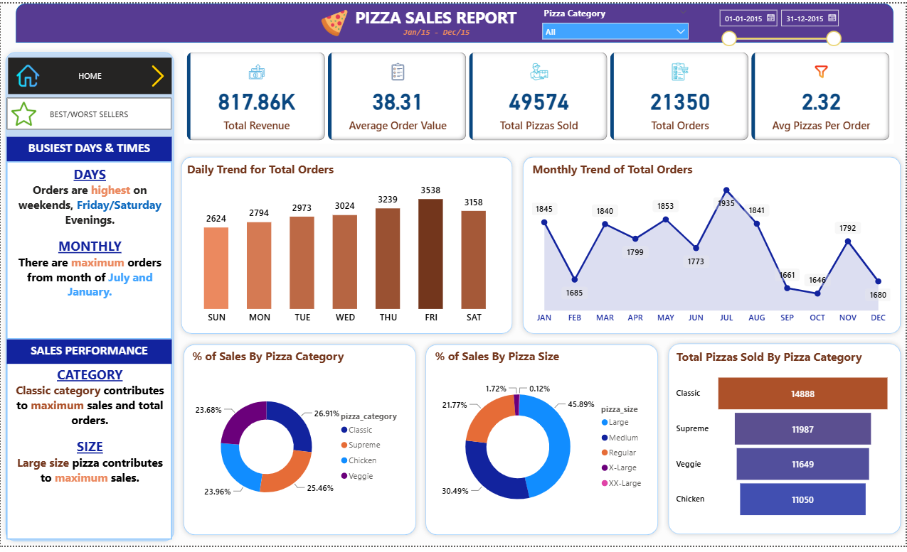
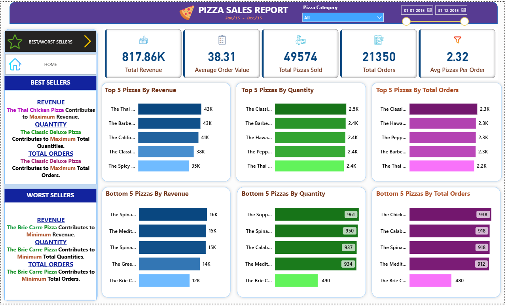

# 🍕 Pizza Sales Analysis | SQL Server & Power BI

## Overview

This project analyzes pizza sales data to uncover business insights related to revenue, customer preferences, sales performance, and ordering trends.
The solution combines SQL Server for data analysis and Power BI for interactive dashboard development, enabling data-driven decision-making through clear visualizations and KPI tracking.

The project covers the complete analytics workflow, including data loading, SQL analysis, Power Query transformations, DAX calculations, dashboard design, navigation, reporting, and presentation creation.

---

## Dataset

The dataset contains transactional pizza sales data, including:

* Order ID
* Order Date
* Pizza Name
* Pizza Category
* Pizza Size
* Quantity Sold
* Unit Price
* Total Price

The data was loaded into SQL Server Management Studio (SSMS) for analysis and reporting.

---

## Tools & Technologies

### Database & Querying

* SQL Server
* SQL Server Management Studio (SSMS)

### Data Transformation

* Power Query

### Business Intelligence

* Power BI Desktop
* DAX (Data Analysis Expressions)

### Documentation & Presentation

* Microsoft PowerPoint
* Gamma AI

---

## Project Workflow

### 1. Data Loading

* Imported pizza sales dataset into SQL Server.
* Validated data structure and relationships.
* Prepared data for analysis.

### 2. SQL Analysis

Performed SQL queries to calculate key business metrics and trends:

#### KPI Analysis

* Total Revenue
* Average Order Value
* Total Pizzas Sold
* Total Orders
* Average Pizzas per Order

#### Trend Analysis

* Daily Trend of Orders
* Monthly Trend of Orders

#### Sales Analysis

* Sales by Pizza Category
* Sales by Pizza Size
* Total Pizzas Sold by Category

#### Performance Analysis

* Top 5 Pizzas by Revenue
* Top 5 Pizzas by Quantity
* Top 5 Pizzas by Total Orders
* Bottom 5 Pizzas by Revenue
* Bottom 5 Pizzas by Quantity
* Bottom 5 Pizzas by Total Orders

### 3. Data Transformation with Power Query

* Cleaned and transformed data
* Corrected data types
* Optimized fields for reporting
* Prepared model for dashboard development

### 4. DAX Measures

Created custom DAX measures for:

* Total Revenue
* Average Order Value
* Total Orders
* Total Pizzas Sold
* Average Pizzas per Order
* Dynamic filtering and KPI calculations

### 5. Dashboard Development

Built a two-page interactive Power BI dashboard featuring:

#### Home Dashboard

* KPI Cards
* Daily Order Trends
* Monthly Order Trends
* Sales by Category
* Sales by Size
* Total Pizzas Sold by Category
* Dynamic Filters

#### Best & Worst Sellers Dashboard

* Top 5 Pizzas by Revenue
* Top 5 Pizzas by Quantity
* Top 5 Pizzas by Orders
* Bottom 5 Pizzas by Revenue
* Bottom 5 Pizzas by Quantity
* Bottom 5 Pizzas by Orders

### 6. User Experience Enhancements

* Conditional Formatting
* Dynamic Filters & Slicers
* Page Navigation Buttons
* Interactive Visualizations
* Cross-filtering between visuals

### 7. Reporting & Presentation

* Created a business insights report.
* Designed a professional presentation using Gamma AI.
* Summarized findings and recommendations for stakeholders.

---

## Dashboard Preview

### Dashboard 1 - Sales Overview



### Dashboard 2 - Best & Worst Sellers



---

## Key Insights

* Generated over **$817K** in total revenue.
* Average order value reached **$38.31**.
* Classic Pizza category contributed the highest sales.
* Large-sized pizzas accounted for the highest percentage of sales.
* Peak ordering activity occurred on Fridays and weekends.
* Identified best-selling and underperforming pizza products for strategic decision-making.

---

## Repository Structure

```text
Pizza-Sales-Analysis/
│
├── Dataset/
├── SQL Queries/
├── Power BI Dashboard/
├── Reports/
├── Presentation/
├── Images/
│   ├── Dashboard_1.png
│   └── Dashboard_2.png
├── README.md
```

---

## How to Run

### Step 1: Load Data

* Import the dataset into SQL Server.

### Step 2: Execute SQL Queries

* Open SQL Server Management Studio.
* Run the SQL scripts located in the `SQL Queries` folder.

### Step 3: Open Power BI Dashboard

* Open the `.pbix` file in Power BI Desktop.
* Refresh the dataset connection if required.

### Step 4: Explore Insights

* Use slicers and navigation buttons to interact with dashboard pages.
* Analyze KPIs, trends, and product performance.

---

## Business Value

This project demonstrates how SQL and Power BI can be used together to transform raw transactional data into actionable business insights. 
The analysis helps stakeholders understand customer preferences, optimize product offerings, improve sales performance, and support data-driven decision-making.

---

## Author

**Ranjitha K**

Data Analyst | SQL | Power BI | Python

End-to-end data analytics project showcasing SQL analysis, Power Query transformations, DAX calculations, dashboard development, business reporting, and data storytelling.
